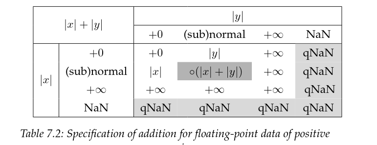
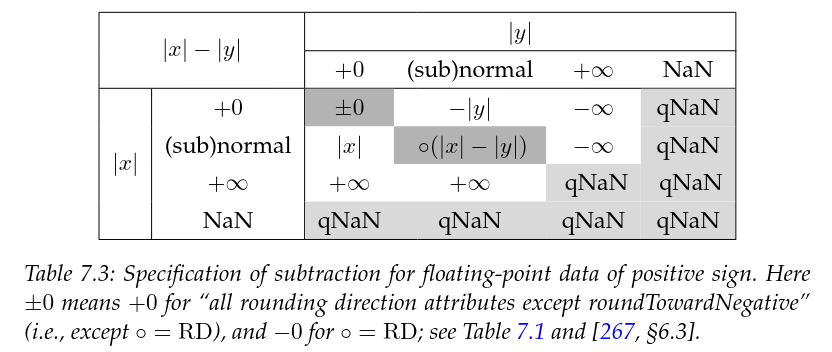
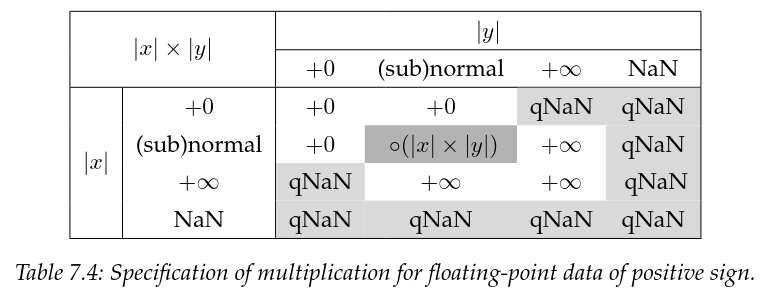

# BFloat16 hardware implementation 

Home to the shared bf16 hardware implementation and verification. 
These modules are designed with the objective on being included in 
future self-funded ASIC tapeouts, as such, area is the primary concerned
followed by performance. Power is not a design prerogative. 
In order to save on logic cost, this hardware only supports 
subnormals so far as to round them to zero.

Supported operations : 
- addition/subtration
- multiplication
- round to zero rouding

Usage assumptions:
- inputs are bf16 
- inputs are never subnormal or any flavor of NaN

Limitations implied by design choices: 
- no NaN support: no addition or multiplication will produce a NaN, add notes on handling corner cases
- no NaN signalling: corollary of above 
- subnormals: all produced subnormals will be clamped to 0
- no support for rounding modes appart from round to zero 

## BFloat16 

The bf16 is not defined as a IEEE-574 floating point format
in the same sense as its contemporaries: the half-precision (f16), single percision (f32),
and double precision (f64), are. 

This lack of standardisation makes its implementation more flexible to the
need of the underlying task. From a hardware designs perspective this also
allows the tradeoffs between supporting certain features present in the IEEE-574
floating point format, and their implementation costs, to be weighed. 

BFloat16 uses the following layout : 
```
[ sign (1 bit) | exponent (8 bits) | significant (7 bits) ]
```

### NaN handeling

Initially the desire was to NOT add support for NaN, unfortunatly 
given $\pm \infty$ is a limit there was no mathematically correct
solution for the following operations : 
```math 

\pm \infty \times 0 = ?
```

As such, I needed to revise my stance on supporting `NaN`. 

That said, this hardware will only produce `qNaN`, conformly with 
the IEEE-754 spec for multiplications and additions. 

#### Operations producting NaN

##### Addition 





##### Multiplication



